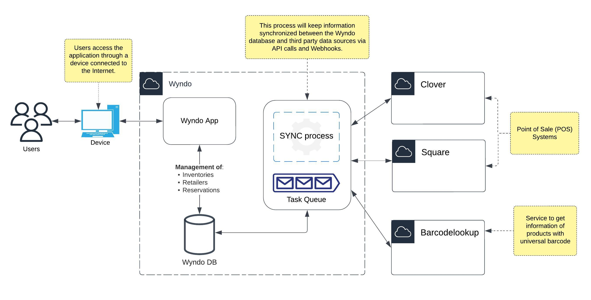

## Wyndo

> Wyndo is a web application that allows access to a catalog of products previously registered from a POS (Point of
> Sale) by retailers. The goal is to allow Wyndo users to reserve products from inventory for purchase in a local area,
> as
> well as to provide retailers with a wider range of visibility for their businesses.

## Solution Diagram



## System requirements

- Python v3.11
- Postgres v15
- Redis v7.0
- Docker v23.0
- Docker Compose v2.17

## Installation

1. Create a copy of file `.env.template` and rename it `.env`

   ```
   cp .env.template .env
   ```

   > **Note**
   > Remember to check the values for each environment variable in the .env.template file (
   see [environment variables section](#environment-variables)).

2. Create a virtual environment using [venv](https://docs.python.org/3/library/venv.html) module (for IDE compatibility
   purposes)

   ```
   python3.11 -m venv .venv && source .venv/bin/activate
   ```

3. Installing dependencies (for IDE compatibility purposes)

   ```
   pip install -r requirements.txt
   ```

4. Start-up of project containers

   ```
   docker-compose up -d
   ```

5. Running project migrations (when new migrations are created within the project)

   ```
   docker exec -it wyndo-app python manage.py migrate
   ```

6. Verify at the following URL http://localhost:8000/admin that you can enter with your superuser credentials (
   see [environment variables section](#environment-variables)).

## How to send an Email

- Send a plain email

Use the `EmailMessage` class provided by Django, add the subject, message and the recipient list (it has to be a list
even when it's only one)

   ```
    subject = 'Email subject'
    message = 'Email body'
    recipient_list = ['me@me.com', ]
    email = EmailMessage(subject=subject, body=message, to=recipient_list)
    email.send()
   ```

- Send and email with a template

Use the `EmailMessage` class provided by Django just like the previous example, but it requires the template and the
object with the information we want to add to the template, after we instantiate the class change the
attribute `content_subtype` to html

   ```
  message = render_to_string{"template.html", {} }
    mail = EmailMessage(
        subject='Email subject',
        body=message,
        to=['me@me.com', ],
    )
    mail.content_subtype = "html"
    return mail.send()
   ```

<a name="environment-variables"></a>

## Running Celery and scheduled tasks

Wyndo contains a feature to manage scheduled tasks in the background
using [Celery](https://docs.celeryq.dev/en/stable/getting-started/introduction.html)
and [django_celery_beat](https://pypi.org/project/django-celery-beat/) module. By default, the inventory loading
processes from Clover and Square are scheduled. In order to test these scheduled tasks it is necessary to execute the
following commands in different command lines:

```
# Start a Celery worker service
celery -A wyndo worker --loglevel=info
```

```
# start the beat service
celery -A wyndo beat -l info --scheduler django_celery_beat.schedulers:DatabaseScheduler
```

> **Note**
> If `docker-compose` is used, it is not necessary to run the above commands. Since each has its own Docker container in
> the `docker-compose.yml` file.

## OAuth URLs for Clover and Square

- `{https | http}`://`{host name}`/retailer/signup/clover
- `{https | http}`://`{host name}`/retailer/signup/square

## Webhook URLs for Clover and Square

- `{https | http}`://`{host name}`/inventory/clover/webhook_events
- `{https | http}`://`{host name}`/inventory/square/webhook_events

## Environment variables

| Variable                                  | Description                                                                                                                                                                                                               |
|-------------------------------------------|---------------------------------------------------------------------------------------------------------------------------------------------------------------------------------------------------------------------------|
| DEBUG                                     | Django debug mode. For local environment it must be set to 1 and for production it must be set to 0.                                                                                                                      |
| SECRET_KEY                                | Is the key to securing signed data – it is vital you keep this secure, or attackers could use it to generate their own signed values.                                                                                     |
| DJANGO_PORT                               | HTTP port where the application will be rendered                                                                                                                                                                          |
| DJANGO_ALLOWED_HOSTS                      | Host or domain names that this Django site can serve. This is a security measure to prevent HTTP Host header attacks.                                                                                                     |
| RDS_HOSTNAME                              | Host or domain of the database server                                                                                                                                                                                     |
| RDS_DB_NAME                               | The name of the database to which the application will connect.                                                                                                                                                           |
| RDS_USERNAME                              | The username of the database to which the application will connect.                                                                                                                                                       |
| RDS_PASSWORD                              | The username's password of the database to which the application will connect.                                                                                                                                            |
| RDS_PORT                                  | The database server port                                                                                                                                                                                                  |
| REDIS_PORT                                | The database server port for Redis                                                                                                                                                                                        |
| REDIS_URL                                 | URL for Redis server                                                                                                                                                                                                      |
| CELERY_ACCEPT_CONTENT                     | A white-list of content-types/serializers to allow                                                                                                                                                                        |
| CELERY_TASK_SERIALIZER                    | A string identifying the default serialization method to uses                                                                                                                                                             |
| CELERY_RESULT_SERIALIZER                  | Result serialization format                                                                                                                                                                                               |
| CELERY_TIMEZONE                           | Configure Celery to use a custom time zone. The timezone value can be any time zone supported by the [ZoneInfo](https://docs.python.org/3/library/zoneinfo.html) library                                                  |
| CELERY_BROKER_CONNECTION_RETRY_ON_STARTUP | Automatically try to establish the connection to the AMQP broker on Celery startup if it is unavailable                                                                                                                   |
| MAIL_HOST                                 | The url of the SMTP server                                                                                                                                                                                                |
| MAIL_USE_TLS                              | If the mail server uses a Transport Layer Security (TLS). It can be 1 or 0.                                                                                                                                               |
| MAIL_PORT                                 | The port of the SMTP server                                                                                                                                                                                               |
| MAIL_USE_SSL                              | If the mail server uses Secure Sockets Layer (SSL). It can be 1 or 0.                                                                                                                                                     |
| MAIL_HOST_USER                            | The user of the SMTP server                                                                                                                                                                                               |
| MAIL_HOST_PASSWORD                        | The user's password of the SMTP server                                                                                                                                                                                    |
| MAIL_FROM                                 | The `FROM:` header of the mail to be sent                                                                                                                                                                                 |
| SUPERUSER_EMAIL                           | The administrator user of the application                                                                                                                                                                                 |
| SUPERUSER_PASSWORD                        | The user's password for the application administrator                                                                                                                                                                     |
| CLOVER_URL                                | URL to connect to Clover services. There are only two options: `https://www.clover.com/` for production and `https://sandbox.dev.clover.com/` for sandbox                                                                 |
| SQUARE_URL                                | URL to connect to Square services. There are only two options: `https://connect.squareup.com` for production and `https://connect.squareupsandbox.com` for sandbox                                                        |
| SQUARE_ENVIRONMENT                        | Square environment to connect to their services. There are only two options: `sandbox` and `production` **Note: It is directly related to** `SQUARE_URL` **, these two should be consistent with the environment to use** |
| GO_UPC_KEY                                | Api Key to connect to Go UPC services                                                                                                                                                                                     | 
| GO_UPC_URL                                | URL to connect to Go UPC services                                                                                                                                                                                         |
| NGROK_AUTH_TOKEN                          | Authentication token to connect to [Ngrok](https://ngrok.com/) service to expose an endpoint to test  webhooks (Only for local environments)                                                                              |
| SQUARE_WEBHOOK_SIGNATURE_KEY              | Signature key to validate Square webhook request                                                                                                                                                                          |
| CLOVER_APP_SECRET                         | App Secret values uniquely identify your app on the Clover platform. These values are required for you to make authorized and authenticated requests to Clover merchant data.                                             |
| SQUARE_APP_SECRET                         | App Secret values uniquely identify your app on the Square platform. These values are required for you to make authorized and authenticated requests to Square merchant data.
                                            |

> **Warning**
> Variables filled in by default in the `.env.tempale` file should not change their value (unless necessary). Only empty
> variables are required for the correct operation of the application. Make sure to pre-fill them before all of the
> above
> steps.

That's all! :rocket: 
